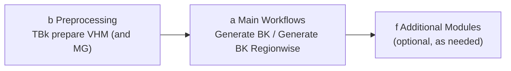

# Workflows

## Basic sequence

A complete TBk run consists of two phases:

1. **Preprocessing** (group b) — bring raw data (VHM, optionally mixture degree) into the form required by TBk, once.
2. **Generate BK** (group a) — the actual main workflow, generates the stand map.
3. **Additional Modules** (group f, optional) — additional analyses based on the finished stand map.

## Phase 1 — Preprocessing

Tool: **TBk prepare VHM (and MG)** ([details](tools.md#b-preprocessing))

Input data (see also [Datasets](datensaetze.md)):

- Vegetation height model (VHM), resolution ≤ 1.5 m
- Mixture degree raster (MG, optional): coniferous proportion in %
- Perimeter (mask) for clipping

!!! warning "Caution: scaling of the mixture degree (MG)"
    The preprocessing tool expects the mixture degree by default with values **0–10,000** (the LFI mixture degree default), where 10,000 corresponds to a coniferous proportion of 100.00%. This is controlled by the advanced parameter **"Rescale Forest mixture degree values"** (default: `100`).

    - If the input raster already contains values **0–100**: set the factor from `100` to `1` (no rescaling).
    - If the input raster instead shows the **deciduous (Laubholz)** proportion (100 = 100% deciduous / 0% coniferous) rather than the coniferous proportion: invert the raster beforehand using `100 − raster value` before using it as input.

Generates the four input rasters for the main workflow: `VHM_10m.tif`, `VHM_150cm.tif`, `MG_10m.tif`, `MG_10m_binary.tif` (the two MG files only if a mixture degree raster was provided).

If the tool is run multiple times, it tries to automatically delete already-existing output files (overwriting isn't possible) — this doesn't work reliably if a file is still open elsewhere. When in doubt, delete manually beforehand or choose a different output location/name.

## Phase 2 — Generate BK

Tool: **Generate BK** ([details](tools.md#a-main-workflows)) chains the following steps automatically:

1. **Delineate Stand** (c) — pixel-wise classification → polygonized, raw stand boundaries
2. **Simplify and Clean** (c) — eliminate small stands, simplify geometry
3. **Merge Similar Neighbours** (d) — merge adjacent stands with similar dominant height (hdom)
4. **Clip to Perimeter and Eliminate Gaps** (d) — clip to the project perimeter, close gaps
5. **Calculate Crown Coverage** (e) — crown coverage (DG) per stand from the 150cm VHM
6. **Add Coniferous Proportion** (e) — coniferous proportion (NH, %) from the mixture-degree raster
7. **Append Stand Attributes** (e) — spatial join: vegetation zone, forest site
8. **TBk Postprocess Cleanup** (g, internal) — final field cleanup → `TBk_Bestandeskarte.gpkg`
9. **Create TBk Project** (g, internal) — generates `TBk_Project.qgz` for visualization

Inputs: the four rasters from Phase 1 plus the project perimeter. An output folder must be specified (see [Usage](anwendung.md#output-location)).

Two optional checkboxes in the dialog:

- **Create subfolder with timestamp** (default: on) — creates a `{YYYYMMDD-HHMM}` subfolder
- **Calculate local densities** (default: off) — additionally runs the local density analysis (can take considerably longer depending on perimeter size)

### Variant: Generate BK Regionwise

Like *Generate BK*, but the perimeter is first split into sub-regions (features) based on an attribute field. Each sub-region goes through the complete process individually, after which all partial results are merged back into one overall stand map.

**Use case**: this allows stand boundaries to be aligned to predefined regions — e.g. logging/access units, ownership boundaries or development boundaries. Within each region, stands are delineated independently of neighbouring regions, so no stand boundary crosses a region boundary.

**Requirement**: for this, the perimeter must already be split into these regions beforehand — as a vector layer with one feature per region (or an attribute field that assigns each feature to its region). TBk itself does not clip the perimeter along the region boundaries; it processes the already-existing sub-regions individually.

## Phase 3 — Additional Modules (optional)

As needed, based on the finished stand map from Phase 2:

- **Local density** — delineate zones of different stand density within the polygons
- **Development stage (ddom/SD)** and **volume estimate (V)** — estimate derived attributes
- **OS Change** — compute the change between two TBk map states
- **WIS.2 export/import** — interface to WIS.2 Web/Desktop

Details on all tools: see [Tools → f Additional Modules](tools.md#f-additional-modules).
