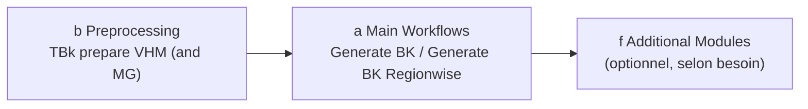

# Workflows

## Déroulement de base

Une exécution complète de TBk comprend deux phases :

1. **Preprocessing** (groupe b) — mettre une fois les données brutes (VHM, éventuellement degré de mélange) dans la forme requise par TBk.
2. **Generate BK** (groupe a) — le workflow principal proprement dit, génère la carte des peuplements.
3. **Additional Modules** (groupe f, optionnel) — analyses complémentaires sur la base de la carte des peuplements terminée.

## Phase 1 — Preprocessing

Outil : **TBk prepare VHM (and MG)** ([détails](tools.md#b-preprocessing))

Données d'entrée (voir aussi [Données](datensaetze.md)) :

- Modèle de hauteur de végétation (VHM), résolution ≤ 1.5 m
- Raster de degré de mélange (MG, optionnel) : proportion de résineux en %
- Périmètre (masque) pour le découpage

!!! warning "Attention : mise à l'échelle du degré de mélange (MG)"
    L'outil de prétraitement attend par défaut le degré de mélange avec des valeurs **0–10'000** (valeur par défaut du degré de mélange LFI), où 10'000 correspond à une proportion de résineux de 100.00 %. Ceci est contrôlé par le paramètre avancé **« Rescale Forest mixture degree values »** (valeur par défaut : `100`).

    - Si le raster d'entrée contient déjà des valeurs **0–100** : mettre le facteur de `100` à `1` (pas de mise à l'échelle).
    - Si le raster d'entrée indique plutôt la proportion de **feuillus** (100 = 100 % feuillus / 0 % résineux) au lieu de la proportion de résineux : inverser le raster au préalable avec `100 − valeur du raster` avant de l'utiliser comme entrée.

Génère les quatre rasters d'entrée pour le workflow principal : `VHM_10m.tif`, `VHM_150cm.tif`, `MG_10m.tif`, `MG_10m_binary.tif` (les deux fichiers MG uniquement si un raster de degré de mélange a été indiqué).

Si l'outil est exécuté plusieurs fois, il tente de supprimer automatiquement les fichiers de sortie déjà existants (l'écrasement n'est pas possible) — cela ne fonctionne pas de manière fiable si un fichier est encore ouvert ailleurs. En cas de doute, le supprimer manuellement au préalable ou choisir un autre emplacement/nom de sortie.

## Phase 2 — Generate BK

Outil : **Generate BK** ([détails](tools.md#a-main-workflows)) enchaîne automatiquement les étapes suivantes :

1. **Delineate Stand** (c) — classification pixel par pixel → limites de peuplements brutes, polygonisées
2. **Simplify and Clean** (c) — éliminer les petits peuplements, simplifier la géométrie
3. **Merge Similar Neighbours** (d) — fusionner les peuplements voisins de hauteur dominante (hdom) similaire
4. **Clip to Perimeter and Eliminate Gaps** (d) — découper selon le périmètre du projet, refermer les lacunes
5. **Calculate Crown Coverage** (e) — degré de couverture (DG) par peuplement à partir du VHM 150cm
6. **Add Coniferous Proportion** (e) — proportion de résineux (NH, %) à partir du raster de degré de mélange
7. **Append Stand Attributes** (e) — jointure spatiale : zone de végétation, station forestière
8. **TBk Postprocess Cleanup** (g, interne) — nettoyage final des champs → `TBk_Bestandeskarte.gpkg`
9. **Create TBk Project** (g, interne) — génère `TBk_Project.qgz` pour la visualisation

Entrées : les quatre rasters de la phase 1 ainsi que le périmètre du projet. Un dossier de sortie doit être indiqué (voir [Utilisation](anwendung.md#emplacement-de-la-sortie)).

Deux cases à cocher optionnelles dans la boîte de dialogue :

- **Create subfolder with timestamp** (par défaut : activé) — crée un sous-dossier `{YYYYMMDD-HHMM}`
- **Calculate local densities** (par défaut : désactivé) — exécute en plus l'analyse de densité locale (peut prendre nettement plus de temps selon la taille du périmètre)

### Variante : Generate BK Regionwise

Comme *Generate BK*, mais le périmètre est d'abord subdivisé en sous-régions (features) sur la base d'un champ d'attribut. Chaque sous-région parcourt le processus complet individuellement, puis tous les résultats partiels sont à nouveau fusionnés en une carte des peuplements globale.

**Cas d'usage** : cela permet d'aligner les limites de peuplements sur des régions prédéfinies — p. ex. unités d'exploitation/desserte, limites de propriété ou limites de desserte. À l'intérieur de chaque région, les peuplements sont délimités indépendamment des régions voisines, de sorte qu'aucune limite de peuplement ne traverse une limite de région.

**Condition préalable** : le périmètre doit pour cela déjà être subdivisé au préalable en ces régions — sous forme de couche vectorielle avec une entité par région (ou un champ d'attribut qui assigne sa région à chaque entité). TBk lui-même ne découpe pas le périmètre selon les limites de région, mais traite individuellement les sous-régions déjà existantes.

## Phase 3 — Additional Modules (optionnel)

Selon besoin, sur la base de la carte des peuplements terminée de la phase 2 :

- **Densité locale** — délimiter des zones de densité de peuplement différente au sein des polygones
- **Stade de développement (ddom/SD)** et **estimation du volume (V)** — estimer des attributs dérivés
- **OS Change** — calculer le changement entre deux états de carte TBk
- **Export/import WIS.2** — interface avec WIS.2 Web/Desktop

Détails sur tous les outils : voir [Outils → f Additional Modules](tools.md#f-additional-modules).
