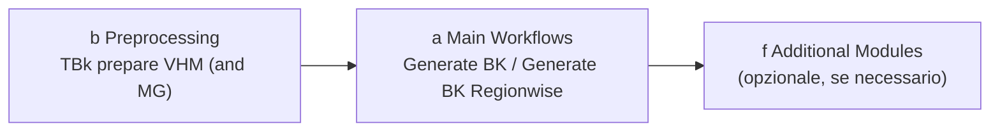

# Workflow

## Sequenza di base

Un'esecuzione completa di TBk è composta da due fasi:

1. **Preprocessing** (gruppo b) — portare una volta i dati grezzi (VHM, eventualmente grado di mescolanza) nella forma richiesta da TBk.
2. **Generate BK** (gruppo a) — il vero e proprio workflow principale, genera la carta dei popolamenti.
3. **Additional Modules** (gruppo f, opzionale) — analisi aggiuntive sulla base della carta dei popolamenti completata.

## Fase 1 — Preprocessing

Strumento: **TBk prepare VHM (and MG)** ([dettagli](tools.md#b-preprocessing))

Dati di input (vedi anche [Dati](datensaetze.md)):

- Modello di altezza della vegetazione (VHM), risoluzione ≤ 1.5 m
- Raster del grado di mescolanza (MG, opzionale): proporzione di conifere in %
- Perimetro (maschera) per il ritaglio

!!! warning "Attenzione: scala del grado di mescolanza (MG)"
    Lo strumento di preprocessing si aspetta per default il grado di mescolanza con valori **0–10'000** (default del grado di mescolanza LFI), dove 10'000 corrisponde a una proporzione di conifere del 100.00%. Questo è controllato dal parametro avanzato **"Rescale Forest mixture degree values"** (default: `100`).

    - Se il raster di input contiene già valori **0–100**: impostare il fattore da `100` a `1` (nessuna riscalatura).
    - Se il raster di input mostra invece la proporzione di **latifoglie** (100 = 100% latifoglie / 0% conifere) anziché la proporzione di conifere: invertire prima il raster con `100 − valore del raster`, prima di usarlo come input.

Genera i quattro raster di input per il workflow principale: `VHM_10m.tif`, `VHM_150cm.tif`, `MG_10m.tif`, `MG_10m_binary.tif` (i due file MG solo se è stato indicato un raster del grado di mescolanza).

Se lo strumento viene eseguito più volte, tenta di eliminare automaticamente i file di output già esistenti (la sovrascrittura non è possibile) — questo non funziona in modo affidabile se un file è ancora aperto altrove. In caso di dubbio, eliminarlo manualmente in anticipo oppure scegliere un'altra posizione/nome di output.

## Fase 2 — Generate BK

Strumento: **Generate BK** ([dettagli](tools.md#a-main-workflows)) concatena automaticamente i seguenti passaggi:

1. **Delineate Stand** (c) — classificazione pixel per pixel → confini di popolamento grezzi, poligonizzati
2. **Simplify and Clean** (c) — eliminare i piccoli popolamenti, semplificare la geometria
3. **Merge Similar Neighbours** (d) — unire i popolamenti adiacenti con altezza dominante (hdom) simile
4. **Clip to Perimeter and Eliminate Gaps** (d) — ritagliare sul perimetro del progetto, chiudere le lacune
5. **Calculate Crown Coverage** (e) — grado di copertura (DG) per popolamento a partire dal VHM a 150cm
6. **Add Coniferous Proportion** (e) — proporzione di conifere (NH, %) a partire dal raster del grado di mescolanza
7. **Append Stand Attributes** (e) — join spaziale: zona di vegetazione, stazione forestale
8. **TBk Postprocess Cleanup** (g, interno) — pulizia finale dei campi → `TBk_Bestandeskarte.gpkg`
9. **Create TBk Project** (g, interno) — genera `TBk_Project.qgz` per la visualizzazione

Input: i quattro raster della fase 1 più il perimetro del progetto. È necessario indicare una cartella di output (vedi [Utilizzo](anwendung.md#posizione-delloutput)).

Due caselle opzionali nella finestra di dialogo:

- **Create subfolder with timestamp** (default: attivo) — crea una sottocartella `{YYYYMMDD-HHMM}`
- **Calculate local densities** (default: disattivo) — esegue in aggiunta l'analisi della densità locale (può richiedere molto più tempo a seconda delle dimensioni del perimetro)

### Variante: Generate BK Regionwise

Come *Generate BK*, ma il perimetro viene prima suddiviso in sotto-regioni (feature) in base a un campo attributo. Ogni sotto-regione attraversa l'intero processo singolarmente, dopodiché tutti i risultati parziali vengono nuovamente uniti in un'unica carta dei popolamenti complessiva.

**Caso d'uso**: questo permette di allineare i confini dei popolamenti a regioni predefinite — ad es. unità di esbosco/accesso, confini di proprietà o confini di accesso. All'interno di ogni regione i popolamenti vengono delimitati indipendentemente dalle regioni vicine, in modo che nessun confine di popolamento attraversi un confine di regione.

**Prerequisito**: per questo il perimetro deve essere già stato suddiviso in anticipo in queste regioni — come layer vettoriale con una feature per regione (oppure un campo attributo che assegna a ogni feature la propria regione). TBk stesso non ritaglia il perimetro secondo i confini di regione, ma elabora singolarmente le sotto-regioni già esistenti.

## Fase 3 — Additional Modules (opzionale)

Se necessario, sulla base della carta dei popolamenti completata della fase 2:

- **Densità locale** — delimitare zone di diversa densità di popolamento all'interno dei poligoni
- **Stadio di sviluppo (ddom/SD)** e **stima del volume (V)** — stimare attributi derivati
- **OS Change** — calcolare la variazione tra due stati della carta TBk
- **Esportazione/importazione WIS.2** — interfaccia con WIS.2 Web/Desktop

Dettagli su tutti gli strumenti: vedi [Strumenti → f Additional Modules](tools.md#f-additional-modules).
