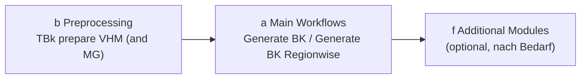

# Workflows

## Grundablauf

Ein vollständiger TBk-Durchlauf besteht aus zwei Phasen:

1. **Preprocessing** (Gruppe b) — Rohdaten (VHM, ggf. Mischungsgrad) einmalig in die von TBk benötigte Form bringen.
2. **Generate BK** (Gruppe a) — der eigentliche Hauptworkflow, erzeugt die Bestandeskarte.
3. **Additional Modules** (Gruppe f, optional) — Zusatzauswertungen auf Basis der fertigen Bestandeskarte.

## Phase 1 — Preprocessing

Werkzeug: **TBk prepare VHM (and MG)** ([Details](tools.md#b-preprocessing))

Eingabedaten (siehe auch [Datensätze](datensaetze.md)):

- Vegetationshöhenmodell (VHM), Auflösung ≤ 1.5 m
- Mischungsgrad-Raster (MG, optional): Nadelholzanteil in %
- Perimeter (Maske) zum Zuschneiden

!!! warning "Achtung: Skalierung des Mischungsgrads (MG)"
    Das Preprocessing-Werkzeug erwartet den Mischungsgrad standardmässig mit Werten **0–10'000** (Default des LFI-Mischungsgrads), wobei 10'000 einem Nadelholzanteil von 100.00 % entspricht. Das steuert der erweiterte Parameter **„Rescale Forest mixture degree values“** (Default: `100`).

    - Enthält das Eingaberaster bereits Werte **0–100**: den Faktor von `100` auf `1` setzen (keine Skalierung).
    - Zeigt das Eingaberaster stattdessen den **Laubholz**-Anteil (100 = 100 % Laubholz / 0 % Nadelholz) statt des Nadelholz-Anteils: das Raster vorher mit `100 − Rasterwert` umkehren, bevor es als Eingabe verwendet wird.

Erzeugt die vier Eingabe-Raster für den Hauptworkflow: `VHM_10m.tif`, `VHM_150cm.tif`, `MG_10m.tif`, `MG_10m_binary.tif` (die beiden MG-Dateien nur, wenn ein Mischungsgrad-Raster angegeben wurde).

Wird das Werkzeug mehrfach ausgeführt, versucht es bereits vorhandene Ausgabedateien automatisch zu löschen (Überschreiben ist nicht möglich) — das funktioniert nicht zuverlässig, wenn eine Datei noch anderswo geöffnet ist. Im Zweifel vorher manuell löschen oder einen anderen Ausgabeort/-namen wählen.

## Phase 2 — Generate BK

Werkzeug: **Generate BK** ([Details](tools.md#a-main-workflows)) verkettet folgende Schritte automatisch:

1. **Delineate Stand** (c) — pixelweise Klassifikation → polygonisierte, rohe Bestandesgrenzen
2. **Simplify and Clean** (c) — kleine Bestände eliminieren, Geometrie vereinfachen
3. **Merge Similar Neighbours** (d) — benachbarte Bestände mit ähnlicher Oberhöhe (hdom) zusammenführen
4. **Clip to Perimeter and Eliminate Gaps** (d) — auf Projektperimeter zuschneiden, Lücken schliessen
5. **Calculate Crown Coverage** (e) — Deckungsgrad (DG) je Bestand aus dem 150cm-VHM
6. **Add Coniferous Proportion** (e) — Nadelholzanteil (NH, %) aus dem Mischungsgrad-Raster
7. **Append Stand Attributes** (e) — räumlicher Join: Vegetationszone, Waldstandort
8. **TBk Postprocess Cleanup** (g, intern) — abschliessende Feld-Bereinigung → `TBk_Bestandeskarte.gpkg`
9. **Create TBk Project** (g, intern) — erzeugt `TBk_Project.qgz` zur Visualisierung

Eingaben: die vier Raster aus Phase 1 sowie der Projektperimeter. Ausgabeordner muss angegeben werden (siehe [Anwendung](anwendung.md#speicherort-der-ausgabe)).

Zwei optionale Häkchen im Dialog:

- **Create subfolder with timestamp** (Standard: an) — legt einen `{YYYYMMDD-HHMM}`-Unterordner an
- **Calculate local densities** (Standard: aus) — führt zusätzlich die lokale Dichteanalyse aus (kann je nach Perimetergrösse deutlich länger dauern)

### Variante: Generate BK Regionwise

Wie *Generate BK*, aber der Perimeter wird zunächst anhand eines Attributfelds in Teilregionen (Features) zerlegt. Jede Teilregion durchläuft den kompletten Ablauf einzeln, danach werden alle Teilergebnisse wieder zu einer gesamten Bestandeskarte zusammengeführt.

**Anwendungsfall**: Damit lassen sich Bestandesgrenzen an vorgegebenen Regionen ausrichten — z.B. Erschliessungseinheiten, Eigentümergrenzen oder Erschliessungsgrenzen. Innerhalb jeder Region werden Bestände unabhängig von benachbarten Regionen abgegrenzt, sodass keine Bestandesgrenze über eine Regionsgrenze hinweg verläuft.

**Voraussetzung**: Der Perimeter muss dafür vorher bereits in diese Regionen aufgeteilt sein — als Vektorlayer mit einem Feature pro Region (bzw. einem Attributfeld, das jedem Feature seine Region zuordnet). TBk selbst schneidet den Perimeter nicht anhand der Regionsgrenzen zu, sondern verarbeitet die bereits vorhandenen Teilregionen einzeln.

## Phase 3 — Additional Modules (optional)

Nach Bedarf, auf Basis der fertigen Bestandeskarte aus Phase 2:

- **Lokale Dichte** — Zonen unterschiedlicher Bestandesdichte innerhalb der Polygone abgrenzen
- **Entwicklungsstufe (ddom/SD)** und **Vorratsschätzung (V)** — abgeleitete Attribute schätzen
- **OS Change** — Veränderung zwischen zwei TBk-Kartenständen berechnen
- **WIS.2-Export/-Import** — Schnittstelle zu WIS.2 Web/Desktop

Details zu allen Werkzeugen: siehe [Tools → f Additional Modules](tools.md#f-additional-modules).
